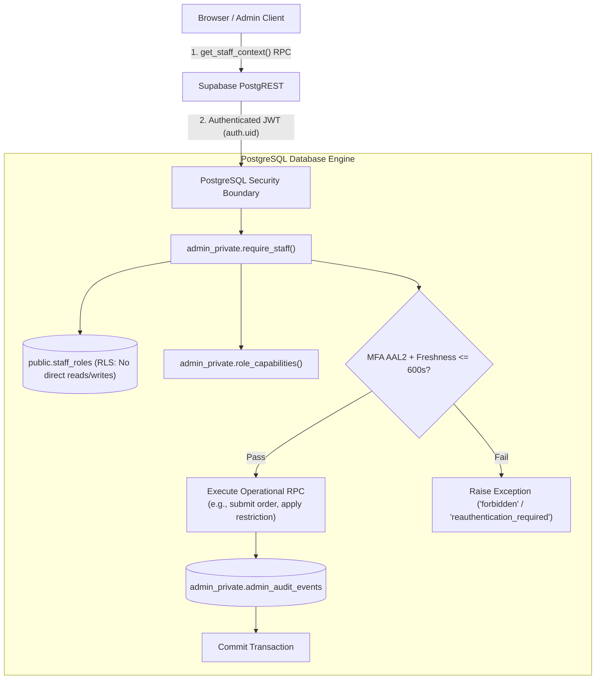
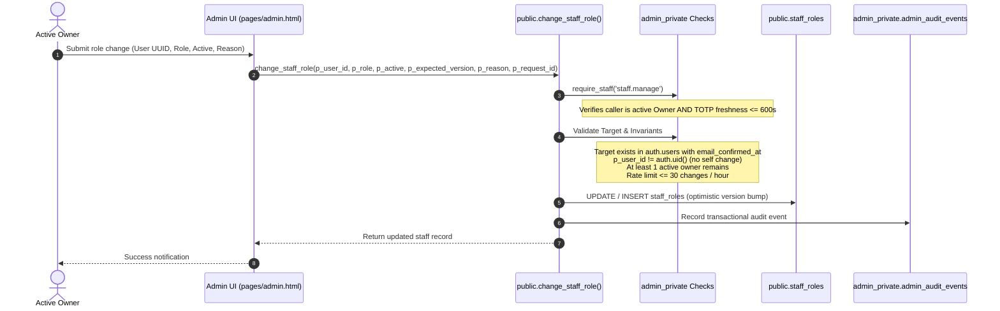

# Privilege Roles & Work Architecture Guide

**Project:** SmartProfitBinary  
**Topic:** Administrative Authorization, Privilege Role Lifecycle, and Operational Work Architecture  
**Scope:** PostgreSQL Security Definers, MFA Freshness, RLS Scoping, and Modular Frontend Operations  

---

## 1. Executive Summary

In SmartProfitBinary, administrative privileges do **not** rely on user metadata flags, JWT tokens stored in browsers, or hardcoded client permissions. All authority is strictly enforced at the **PostgreSQL database engine level** via:

1. **Dedicated, immutable database roles table** (`public.staff_roles`) with RLS denying direct client access.
2. **Centralized capability resolution** (`admin_private.role_capabilities`).
3. **Guard functions** (`admin_private.require_staff`) running with empty search paths (`security definer set search_path = ''`).
4. **Time-bounded MFA (TOTP) freshness verification** for sensitive operational actions.
5. **Atomic audit trails** (`admin_private.admin_audit_events`) where failed logging automatically rolls back the triggering mutation.



---

## 2. Staff Roles Hierarchy

The platform defines three distinct staff roles within `public.staff_roles`:

| Role | Target Audience | Primary Responsibilities | Direct Access Scope |
|---|---|---|---|
| `support_agent` | Customer Support Representatives | Resolving customer tickets, answering inquiries, internal collaboration. | Assigned support tickets only (`support.read_assigned`). No access to customer accounts, orders, or markets. |
| `administrator` | Operations & Compliance Staff | Platform oversight, customer risk mitigation, market stability. | Full support inbox, customer directory, demo balance inspection, trading restrictions, demo trading logs, market controls. |
| `owner` | Platform Owners & Senior Executives | Governance, security audits, staff lifecycle management. | All administrator capabilities + staff role promotion/demotion/deactivation (`staff.manage`) and full audit trail inspection (`audit.read`). |

---

## 3. How Privilege Roles Are Granted

Role granting follows a strict lifecycle designed to prevent self-elevation, phantom accounts, or unauthorized privilege creep.



### 3.1 Step 1: Initial Bootstrap (The Genesis Problem)
Before any owner exists, no user has permission to grant roles. The system solves this via a dedicated, private bootstrap routine:

```sql
admin_private.bootstrap_owner(p_user_id uuid, p_email text, p_reason text)
```

- **Guards:**
  - Can **only** be executed if `SELECT count(*) FROM public.staff_roles` is `0`.
  - Verifies that `p_user_id` exists in `auth.users` and that `email_confirmed_at` is not null.
  - Revoked from all web roles (`authenticated`, `anon`, `service_role`). It can only be invoked directly via server-side database migrations or the infrastructure console.
- **Outcome:** Seeds the initial `owner` row with `version = 0` and emits an audit event.

### 3.2 Step 2: Granting & Modifying Subsequent Staff Roles
Once the platform has an owner, all role grants and status modifications must go through:

```sql
public.change_staff_role(
    p_user_id uuid,
    p_role text,
    p_active boolean,
    p_expected_version integer,
    p_reason text,
    p_request_id uuid
)
```

The function executes the following verification pipeline inside an atomic transaction:

1. **Caller Authorization & MFA Freshness:**
   - Calls `admin_private.require_staff('staff.manage')`.
   - Confirms the caller is an active `owner`.
   - Checks the caller's JWT `amr` (Authentication Methods References) claim: the latest `totp` verification timestamp must be **within the past 10 minutes (600 seconds)**. If older, it raises `reauthentication_required`.
2. **Self-Change Prevention:**
   - If `p_user_id = auth.uid()`, raises `self_role_change_forbidden`. Owners cannot promote, demote, or deactivate themselves to prevent accidental lockout or governance evasion.
3. **Last-Owner Invariant:**
   - If deactivating an owner or changing an owner's role, the database asserts:
     ```sql
     SELECT count(*) FROM public.staff_roles 
     WHERE role = 'owner' AND active = true AND user_id <> p_user_id
     ```
     Must be `>= 1`. The platform will never allow demoting or disabling the last active owner.
4. **Verified Target Identity:**
   - Confirms `p_user_id` exists in `auth.users` and has `email_confirmed_at IS NOT NULL`. Phantom or unconfirmed emails cannot receive roles.
5. **Rate Limiting:**
   - Counts the caller's `staff.role_change` audit events created within the last hour and raises `rate_limited` once that count reaches 30. Max 30 role modifications per hour per owner.
6. **Optimistic Concurrency Control:**
   - Matches `p_expected_version` against `staff_roles.version`. If another owner changed the record concurrently, raises `conflict`.
7. **Idempotency Safeguard:**
   - Deduplicates identical submissions via `p_request_id` to ensure network retries do not trigger duplicate mutations.
8. **Transactional Audit Insertion:**
   - Logs an audit row with actor ID, target user ID, old role, new role, reason, and IP metadata. If the audit insert fails for any reason, the entire transaction rolls back.

---

## 4. Capability Matrix & Least Privilege

Capabilities are resolved in `admin_private.role_capabilities(role)`:

| Capability Code | Description | Support Agent | Administrator | Owner |
|---|---|:---:|:---:|:---:|
| `staff.enter` | Access the admin workspace portal | ✅ | ✅ | ✅ |
| `support.read_assigned` | View tickets assigned to oneself | ✅ | ✅ | ✅ |
| `support.read_all` | View unassigned tickets & all queues | ❌ | ✅ | ✅ |
| `support.reply` | Post public replies to customers | ✅ | ✅ | ✅ |
| `support.note` | Post internal staff-only notes | ✅ | ✅ | ✅ |
| `support.transition` | Advance ticket lifecycle (in progress, waiting, etc.) | ✅ | ✅ | ✅ |
| `support.assign` | Reassign tickets between staff members | ❌ | ✅ | ✅ |
| `support.close` | Archive/close tickets permanently | ❌ | ✅ | ✅ |
| `customers.read` | Search customer accounts & inspect balances | ❌ | ✅ | ✅ |
| `customers.restrict_trading` | Apply/lift demo trading account restrictions | ❌ | ✅ | ✅ |
| `trading.read_demo` | Inspect all demo orders, fills, and execution states | ❌ | ✅ | ✅ |
| `markets.manage` | Inspect quote freshness & pause/resume symbols | ❌ | ✅ | ✅ |
| `operations.read` | View platform-wide operational KPIs & metrics | ❌ | ✅ | ✅ |
| `staff.manage` | Change staff roles and activate/deactivate accounts | ❌ | ❌ | ✅ |
| `audit.read` | Read system administrative audit logs | ❌ | ❌ | ✅ |

---

## 5. Work Architecture & Functional Modules

The administrative dashboard consists of five core functional modules organized cleanly across frontend controllers and database RPCs:

```
┌─────────────────────────────────────────────────────────────────────────────┐
│                          STAFF WORKSPACE CONSOLE                            │
├─────────────┬─────────────┬─────────────┬─────────────┬───────────┬─────────┤
│   Support   │  Overview   │  Customers  │Demo Trading │  Markets  │  Staff* │
├─────────────┴─────────────┴─────────────┴─────────────┴───────────┴─────────┤
│                                                                             │
│  [Module Controllers: assets/js/admin.js & assets/js/admin-operations.js]   │
│                                                                             │
├─────────────────────────────────────────────────────────────────────────────┤
│                          SECURITY DEFINER RPCs                              │
│                                                                             │
│  • list_support_tickets      • apply_account_restriction                    │
│  • get_platform_overview     • list_admin_demo_orders                       │
│  • list_admin_customers      • list_admin_market_health                     │
│  • get_admin_customer_detail • set_symbol_trading_status                    │
│  • change_staff_role*        • list_admin_audit*                            │
├─────────────────────────────────────────────────────────────────────────────┤
│                         POSTGRESQL STORAGE & RLS                            │
│                                                                             │
│  • staff_roles              • support_tickets & messages                   │
│  • account_restrictions     • orders & fills                               │
│  • market_symbol_controls   • admin_audit_events                            │
└─────────────────────────────────────────────────────────────────────────────┘
  * Restricted to Owner role
```

### 5.1 Platform Overview Module
- **Purpose:** Executive dashboard displaying real-time platform metrics.
- **RPC:** `public.get_platform_overview()` (requires `operations.read`).
- **Data Provided:** Open ticket counts, unassigned tickets, verified customer counts, active trading restrictions, demo orders placed today, and unhealthy market symbols.

### 5.2 Customer Administration & Restrictions Module
- **Purpose:** Customer directory search, demo asset inspection, and risk mitigation.
- **RPCs:** `public.list_admin_customers()`, `public.get_admin_customer_detail()`, `public.apply_account_restriction()`, `public.lift_account_restriction()`.
- **Trading Engine Enforcement:**
  - Table: `public.account_restrictions`.
  - When an administrator restricts a customer, `submit_demo_order` queries active restrictions. If present, the trade is rejected immediately with `customer_trading_restricted`.

### 5.3 Demo Trading Oversight Module
- **Purpose:** Transparent, read-only monitoring of all customer demo activity.
- **RPCs:** `public.list_admin_demo_orders()`, `public.get_admin_demo_order_detail()`.
- **Ledger Invariant:** Administrative staff can **never** manually edit customer wallet balances or insert fake executions. All demo ledger entries remain strictly event-driven.

### 5.4 Markets & Instrument Health Module
- **Purpose:** Monitor upstream quote freshness and enforce emergency trading halts.
- **RPCs:** `public.list_admin_market_health()`, `public.set_symbol_trading_status()`.
- **Engine Enforcement:**
  - Table: `public.market_symbol_controls`.
  - If a market symbol is marked as `PAUSED`, `submit_demo_order` rejects new orders with `market_trading_paused`.

### 5.5 Support Ticketing Module
- **Purpose:** Shared, dual-purpose customer service workspace.
- **Architecture:** `SupportWorkspace` (`assets/js/support-ui.js`) is used by both customers (`pages/support.html`) and staff (`pages/admin.html`), with UI capabilities automatically branching based on caller context.

---

## 6. Defensive Security Principles

1. **Empty Search Path:** Every administrative function explicitly sets `search_path = ''` to prevent search path hijacking attacks.
2. **Denial by Default:** Tables have Row Level Security enabled. No table grants `SELECT`, `INSERT`, `UPDATE`, or `DELETE` directly to client roles.
3. **Audit Immutability:** `admin_private.admin_audit_events` cannot be modified or truncated by any database user or application role.
4. **Zero Client Authority:** The client browser is treated as untrusted. Hiding a button or manipulating DOM elements does not bypass server-side RPC permission checks.
